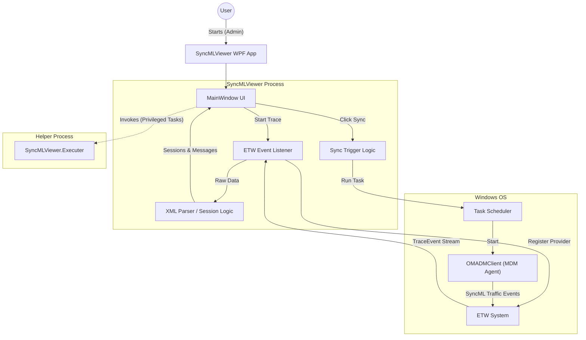

# SyncMLViewer Project Documentation

## Overview
SyncMLViewer is a Windows Presentation Foundation (WPF) application designed to monitor, analyze, and troubleshoot Mobile Device Management (MDM) activities on Windows. It works by capturing the SyncML protocol stream between the Windows client and the management system (like Microsoft Intune) using Event Tracing for Windows (ETW).

## Architecture
The solution consists of two main projects:
1.  **SyncMLViewer**: The main WPF application.
    -   **Framework**: .NET Framework 4.7.2
    -   **UI**: WPF with `AvalonEdit` for syntax highlighting.
    -   **Core Logic**: Directly largely in `MainWindow.xaml.cs`.
2.  **SyncMLViewer.Executer**: A helper Console application.
    -   **Framework**: .NET Framework 4.7.2
    -   **Purpose**: handles privileged or isolated tasks, such as managing local MDM enrollments or executing specific commands that might interfere with the main process or require a separate context.
    -   **Deployment**: Embedded as a resource inside the main SyncMLViewer executable and extracted at runtime.

### Architecture Diagram

## Core Mechanisms

### 1. Functionality: Capturing Traffic (ETW)
The key functionality relies on **Microsoft.Diagnostics.Tracing.TraceEvent**.
-   **Session Creation**: The app starts a real-time ETW user mode session.
-   **Providers**: It enables specific MDM providers, notably `OmaDmClient` and `OmaDmClientProvider`.
-   **Data Processing**:
    -   Events are captured in `WorkerTraceEvents` and processed in `WorkerProgressChanged`.
    -   The app looks for `OmaDmSyncmlVerboseTrace` events which contain the raw SyncML XML.
    -   **Truncation Handling**: ETW buffers are limited to 64KB. The app detects truncated XML (missing `</SyncML>`) and artificially closes the tags to ensure the XML parser can still display the data, even if incomplete.

### 2. Functionality: Triggering Syncs
To force Windows to sync with the MDM server, the application does not use undocumented APIs directly but instead utilizes the Windows Task Scheduler (`schtasks.exe`).
-   It identifies the internal scheduled tasks created by the enrollment client (under `Microsoft\Windows\EnterpriseMgmt`).
-   It triggers these tasks via `Process.Start`, effectively simulating a "Sync Now" action native to Windows.

### 3. Functionality: Parsing & Visualization
-   The raw XML streams are parsed to extract `SessionID` and `MsgID`.
-   Sessions are composed into `SyncMlSession` objects.
-   The UI provides tabs to view the raw stream, parsed messages, and analyzed status codes.
-   `ICSharpCode.AvalonEdit` is used for the text editor components to provide XML syntax highlighting and folding.

## Project Structure

### Root Directory
-   `SyncMLViewer.sln`: The Visual Studio Solution file.
-   `LICENSE`, `README.md`: Standard project metadata.

### Project: SyncMLViewer (Main App)
-   **App.xaml / App.xaml.cs**: Application entry point.
-   **MainWindow.xaml / MainWindow.xaml.cs**:
    -   Contains the majority of the business logic (ViewModel-like properties, event handling, ETW management).
    -   **Key Methods**:
        -   `WorkerTraceEvents`: Sets up the trace session.
        -   `ButtonMDMSync_Click`: Triggers the system sync task.
-   **SyncMlSession.cs**: Data model representing a single sync session.
-   **SyncMlMessage.cs**: Data model for individual messages within a session.
-   **MdmDiagnostics.cs**: Helper class to gather system info (Hostname, OS Version, etc.) for the diagnostics tab.
-   **Helper.cs**: Contains general utility functions (XML formatting, hex dumps, etc.).
-   **Dist/**: Contains release zips (likely for the auto-update mechanism).

### Project: SyncMLViewer.Executer (Helper)
-   **Program.cs**: Entry point for the helper tool.
-   **MdmLocalManagement.cs**: Contains logic for local management tasks which might be invoked by the main app.
-   **PostBuildScript-*.ps1**: Scripts to handle post-build tasks, likely ensuring the Executer is correctly packaged or copied for the main app to embed.

## Build Engine & Dependencies
-   **Build System**: MSBuild.
-   **External Libraries (NuGet)**:
    -   `Microsoft.Diagnostics.Tracing.TraceEvent`: ETW handling.
    -   `Costura.Fody`: Embeds DLL dependencies into the main executable for a single-file distribution.
    -   `Newtonsoft.Json`: JSON parsing.
    -   `AvalonEdit`: Text editor control.
-   **Prerequisites**: The app requires Administrator privileges to run because collecting global ETW traces is a privileged operation.

## How to Run

To use the program, you have two options depending on whether you want to run the pre-built version or build it yourself from the source code.

### Option 1: Use the Pre-built Version (Easiest)
The repository includes pre-compiled versions in the `dist` folder.
1.  Navigate to **`dist`** directory within the project root.
2.  Locate the latest zip file (e.g., **`SyncMLViewer-v140.zip`**).
3.  **Right-click** and **Extract All** to a folder of your choice.
4.  Open the extracted folder and run **`SyncMLViewer.exe`** as **Administrator**.

### Option 2: Build from Source
If you want to modify or build the code yourself:
1.  Open **`SyncMLViewer.sln`** in Visual Studio (2019 or later recommended).
2.  Restore NuGet packages.
3.  Go to **Build** > **Build Solution** (or press `Ctrl+Shift+B`).
4.  Once built, the executable will be generated in `SyncMLViewer\bin\Debug\` or `bin\Release\`.
5.  Run **`SyncMLViewer.exe`** as **Administrator**.

**Note:** The application requires **Administrator privileges** to run because it uses ETW (Event Tracing for Windows) to capture the system's MDM traffic, which is a privileged operation.
